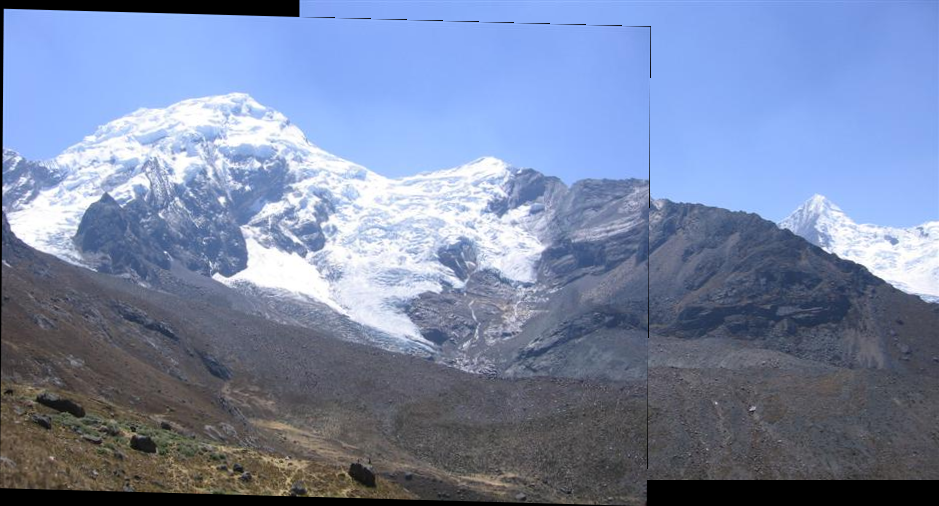
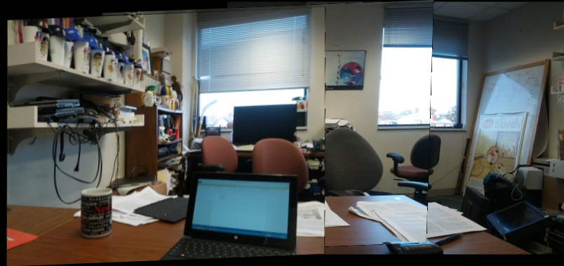
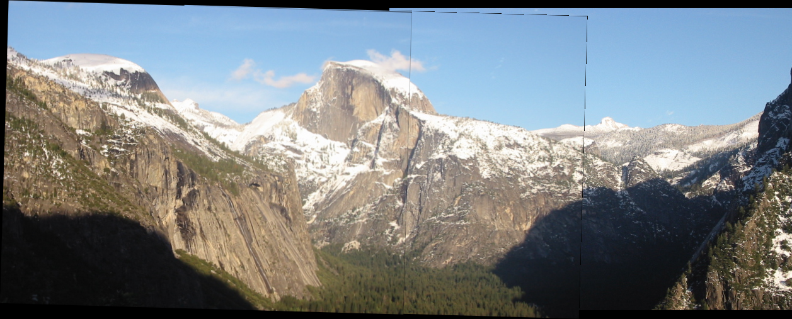
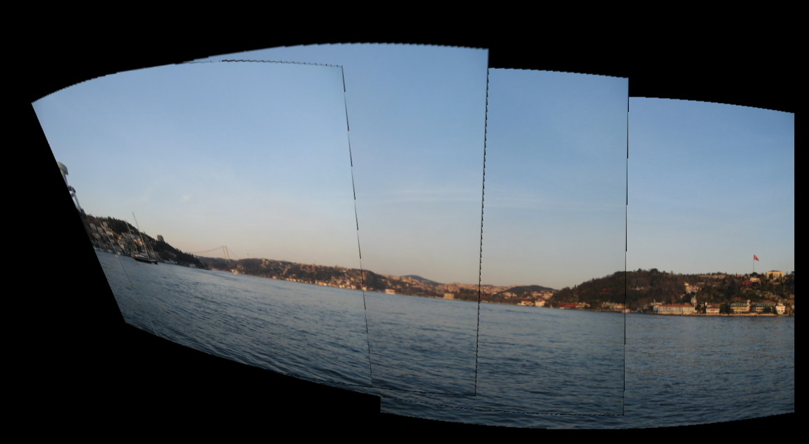
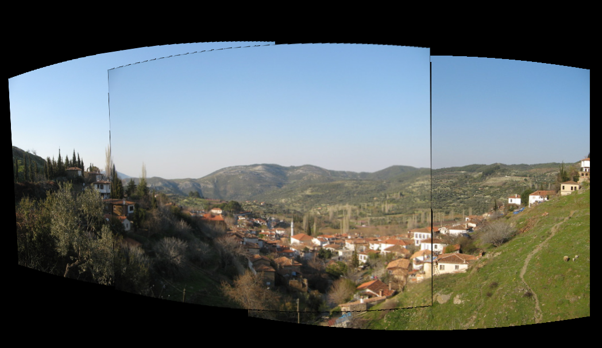
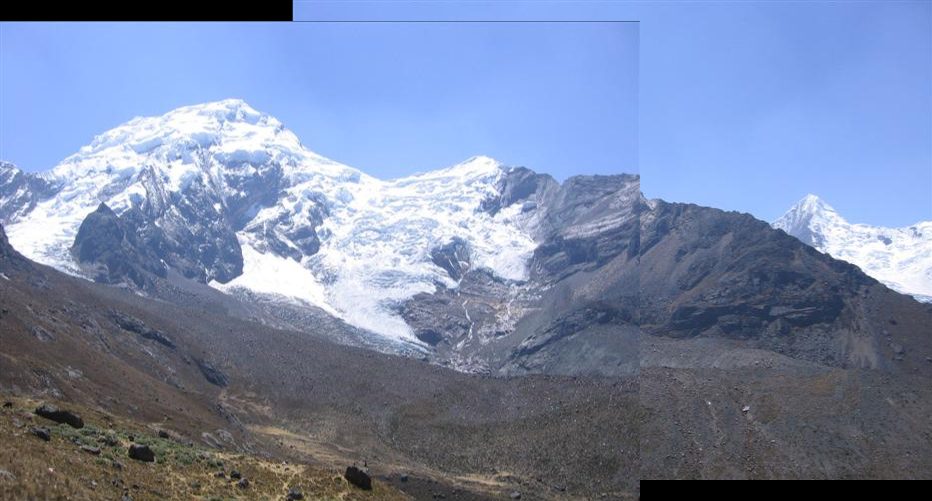
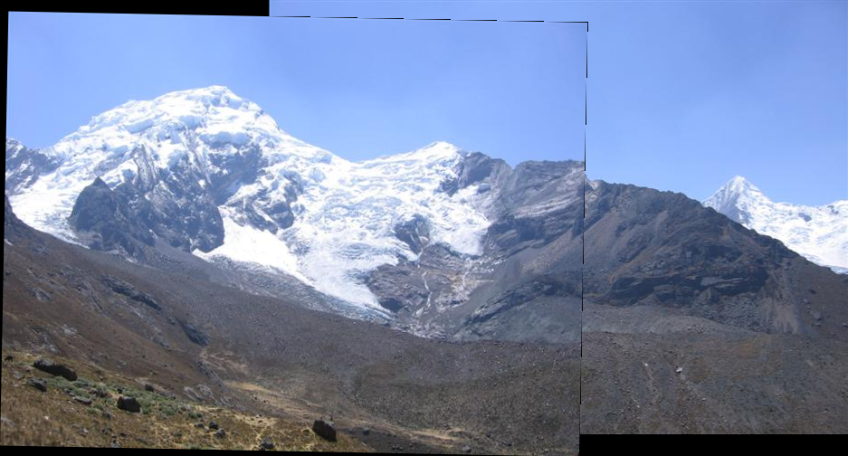

# Project 5: Panorama Stitching

## Overview

This project implements various image stitching techniques to create panoramic images from multiple overlapping photographs. The implementation includes both homography-based and cylindrical warping approaches, with support for different transformation types including translation, rigid, affine, and homography transformations.

## Features

- **Multiple Transformation Types**: Supports translation, rigid, affine, and homography transformations
- **Robust Feature Matching**: Uses RANSAC for outlier rejection in feature correspondence
- **Cylindrical Warping**: Implements cylindrical projection for wide-angle panoramas
- **EXIF Data Integration**: Extracts focal length and sensor information from image metadata
- **Comprehensive Testing**: Includes 8 different test datasets with various scene types

## Project Structure

```
project5-panorama/
├── code/
│   ├── main.py              # Main execution script
│   ├── student.py           # Core transformation and warping functions
│   ├── correspondences.py   # Feature detection and matching
│   └── exifextract.py      # EXIF data extraction utilities
├── data/                    # Input image datasets
│   ├── source001    # Test dataset 1
│   ├── source002    # Test dataset 2
│   └── ...                 # Additional datasets
├── results/                 # Generated panorama outputs
└── writeup/                # Project documentation
```

## Implementation Details

### Core Functions

#### `calculate_transform(pointsA, pointsB, mode, useRANSAC)`

Computes transformation matrices between corresponding point sets:

- **Translation**: Simple x,y offset calculation
- **Rigid**: Rotation + translation using SVD
- **Affine**: Linear transformation with 6 degrees of freedom
- **Homography**: Full perspective transformation

#### `warp_images(A, B, transform_M)`

Aligns two images using the computed transformation:

- Calculates bounding box for both images after transformation
- Applies necessary translation to keep images in positive coordinates
- Returns warped versions ready for compositing

#### `composite(imgA, imgB)`

Blends two aligned images using alpha masking:

- Uses non-zero pixel regions as masks
- Simple alpha blending for overlapping areas

## Results Gallery

### Homography Transformations

The homography transformation provides the most flexible alignment, handling perspective changes between images:


_Source 1 panorama using homography transformation_


_Source 3 panorama using homography transformation_


_Source 5 panorama using homography transformation_

### Cylindrical Warping

Cylindrical warping is particularly effective for wide-angle panoramas, reducing distortion:


_Source 6 panorama using cylindrical warping_


_Source 7 panorama using cylindrical warping_

### Comparison of Transformation Types

Different transformation types produce varying results:


_Translation transformation - simple but limited_


_Rigid transformation - rotation + translation_


_Affine transformation - handles scaling and shearing_


_Homography transformation - full perspective correction_

## Usage

### Running the Complete Pipeline

```bash
cd code
python main.py
```

This will process all datasets in the `data/` directory and generate panoramas for each transformation type.

### Processing a Single Dataset

```bash
python main.py -s ../data/source001
```

### Available Modes

- **Homography**: Full perspective transformation (default)
- **Cylindrical**: Cylindrical warping for wide-angle scenes

## Technical Implementation

### Feature Detection and Matching

- Uses OpenCV's feature detection algorithms
- Implements robust matching with RANSAC outlier rejection
- Supports both manual least-squares and robust estimation

### Transformation Estimation

- **Least Squares**: Direct matrix computation for clean data
- **RANSAC**: Robust estimation using OpenCV's USAC_MAGSAC algorithm
- Handles degenerate cases and insufficient correspondences

### Image Warping

- Perspective warping for homography transformations
- Affine warping for simpler transformations
- Automatic bounding box calculation and translation

### Compositing

- Alpha channel handling for transparent borders
- Mask-based blending for overlapping regions
- Support for both RGB and RGBA image formats

## Dependencies

- OpenCV (cv2)
- NumPy
- SciPy
- Matplotlib
- tqdm (for progress bars)

## Dataset Information

The project includes 8 test datasets with varying characteristics:

- \*\*source001-002mple indoor scenes
- \*\*source34 Outdoor panoramas
- \*\*source005mplex urban scenes
- **source006**: Natural landscapes (Yosemite)
- \*\*source78arious scene types

Each dataset contains 2-5 overlapping images suitable for panorama creation.

## Performance Notes

- Cylindrical warping requires valid EXIF focal length data
- RANSAC significantly improves robustness to feature matching outliers
- Homography transformations work best for most real-world scenarios
- Translation and rigid transforms are fastest but most limited

## Future Improvements

- Multi-band blending for seamless transitions
- Exposure compensation for varying lighting conditions
- Automatic seam finding for optimal compositing
- GPU acceleration for large panoramas
- Support for spherical and equirectangular projections
